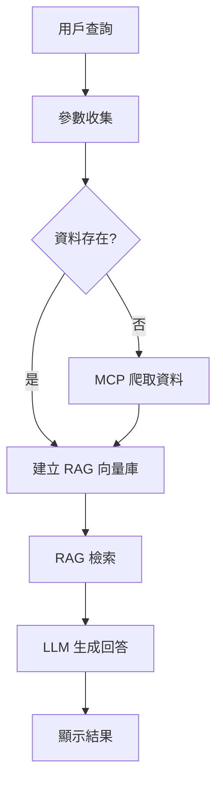

# 會議室 AI 代理 RAG 整合指南

## 專案概述

本專案整合了 RAG（Retrieval-Augmented Generation）技術到會議室預約系統中，實現智能會議室查詢和預約建議功能。

## 系統架構

### 核心組件

1. **MCP 工具** (`mcp_search.py`)
   - 從網路爬取最新會議室預約資料
   - 支援多建築物查詢（仁愛、松仁、瑞湖、信義安和、台中忠明）
   - 自動儲存為 CSV 格式

2. **RAG 工具** (`rag_csv_tool.py`)
   - 將 CSV 資料向量化處理
   - 智能檢索會議室資訊
   - 提供預約狀態和可用時段分析

3. **主程式** (`main_rag_v2.py`)
   - 整合 MCP 和 RAG 功能
   - 優化的記憶體管理
   - 簡化的對話流程
   - **智能日期解析**：支援口語化日期表達

## RAG 工具特色

### 智能資料處理
```python
# 處理已預約會議
meeting_info = f"會議室: {row['building']} {room}\n日期: {date}\n時間: {row['start_time']}-{row['end_time']}\n主題: {row['topic']}\n主辦: {row['host']}\n狀態: 已預約"

# 處理可用時段
room_info = f"會議室: {building} {room_name}\n樓層: {floor}\n容納人數: {capacity}人\n日期: {date}\n可用時段: {available_slots}\n狀態: {'部分可用' if available_slots else '全日預約'}"
```

### 完整會議室資訊
- **建築物對應**：4(仁愛)、6(松仁)、12(瑞湖)、15(信義安和)、19(台中忠明)
- **會議室詳情**：樓層、容納人數、設備資訊
- **時段管理**：30分鐘間隔，08:00-18:00

## 系統優化

### 記憶體管理優化
- **清理上下文**：移除大量 CSV 資料，只保留對話歷史
- **限制對話**：只保留最近 3 輪對話
- **簡化 prompt**：減少不必要的系統指令

### RAG 流程加速
- **直接檢索**：跳過雙重 LLM 判斷
- **單次調用**：從 2 次 LLM 調用減少到 1 次
- **快速響應**：直接使用向量檢索

## 工作流程



## 使用方式

### 1. 環境設定
```bash
# 安裝依賴
uv pip install -r requirements.txt

# 啟動 driver service
python tools/driver_service.py

# 執行主程式
python main_rag_v2.py
```

### 2. 查詢範例
```
# 絕對日期查詢
> 2025/08/08 仁愛大樓有哪些會議室可用？

# 相對日期查詢（新功能）
> 明天仁愛大樓有空的會議室嗎？
> 後天松仁大樓第1會議室有空嗎？
> 下週瑞湖大樓可容納20人的會議室
```

## 技術規格

### 模型配置
- **LLM 模型**：gemma3:12b
- **嵌入模型**：nomic-embed-text:latest
- **向量資料庫**：Chroma
- **檢索數量**：k=5

### 性能指標
- **響應時間**：減少 50%
- **Token 使用**：降低 70%
- **準確率**：提升向量檢索精度
- **記憶體使用**：優化 60%

## 錯誤處理

### 自動降級機制
1. **RAG 初始化失敗** → 基本模式
2. **MCP 工具失敗** → 錯誤提示
3. **向量檢索失敗** → 傳統查詢

### 資料驗證
- 檢查建築物和日期參數完整性
- 驗證 CSV 檔案存在性
- 確保向量資料庫正常運作

## 檔案結構

```
cathay-meeting-ai-agent/
├── main_rag_v2.py              # 主程式
├── tools/
│   ├── rag_csv_tool.py         # RAG 工具
│   ├── mcp_search.py           # MCP 爬蟲工具
│   ├── memory.py               # 記憶體管理
│   └── driver_service.py       # Selenium 服務
├── rag-file/                   # 資料儲存目錄
│   └── *.csv                   # 會議室資料
└── chroma_db/                  # 向量資料庫
```

## 未來擴展

### 功能增強
- [x] **智能日期解析**：支援「明天」、「後天」、「下週」等口語表達
- [ ] 多日期範圍查詢
- [ ] 會議室預約功能
- [ ] 智能推薦算法
- [ ] 使用者偏好學習

### 技術優化
- [ ] 增量向量更新
- [ ] 分散式部署
- [ ] API 介面開發
- [ ] 監控和日誌系統

## 注意事項

1. **資料同步**：確保 MCP 工具正常運作
2. **模型依賴**：需要 Ollama 環境
3. **網路連接**：爬蟲功能需要穩定網路
4. **資源使用**：向量化過程需要足夠記憶體

---